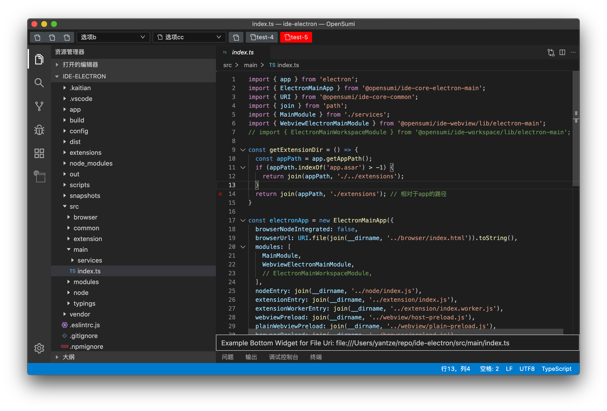

# OpenSumi IDE Electron 集成示例

## 启动步骤

```shell
git clone git@github.com:opensumi/ide-electron.git
cd ide-electron
yarn
yarn run build
yarn run rebuild-native -- --force-rebuild=true
npm run download-extension # 可选
npm run start
```

- 运行效果
  

## 如何开发

首先需要在根目录执行 `watch`。

```bash
tnpm run watch
```

然后再开一个终端，进行：

```bash
tnpm run start
```

打开编辑器之后，当代码有新改动时，打开编辑器内的命令行：<kbd>shift</kbd>+<kbd>command</kbd>+<kbd>p</kbd>，输入 `Reload Window` 即可看到新变化。

## 如何定制

1. 去掉示例代码，可以直接删除 `src/browser/index.ts` 中的 `StartupModule` 即可。

2. 如何实现 browser 与 node 通讯，可以看看 Topbar 的实现。启用可以取消注释， `src/browser/index.ts` 和 `src/node/index.ts` 中 TopbarModule 的注释。

### 切换软件图标

1. 通过 Cmd+Shift+p 打开输入框，输入「文件图标主题」可以在下拉列表中切换，也可以自行在插件市场选择其它图标主题。

## 打包成 dmg

只需要简单的执行 `tnpm run pack` 即可在 `./out/mac` 中看到生成的 `out/Kaitian IDE-1.0.0.dmg`。

> 在打包脚本中加了 `CSC_IDENTITY_AUTO_DISCOVERY=false` 以便打包时不进行签名。
