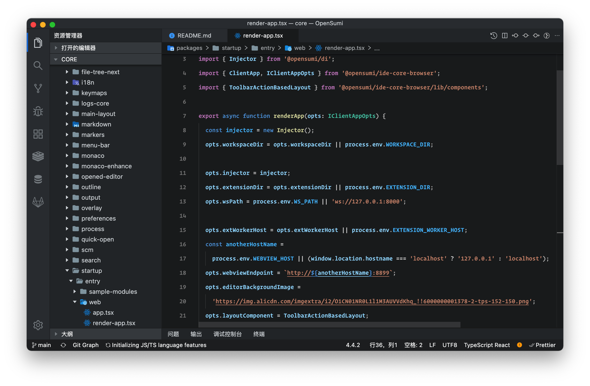

# OpenSumi IDE Electron

English | [中文文档](https://opensumi.com/zh/docs/integrate/quick-start/electron)



## Startup

```shell
git clone git@github.com:opensumi/ide-electron.git
cd ide-electron
yarn
yarn build
yarn rebuild-native --force-rebuild=true
yarn download-extension # install extension (Optional)
yarn start
```

to use the China CDN mirror, checkout branch `main-cn`:

```shell
git checkout main-cn
```

## Develop

Start application:

```shell
yarn watch
yarn start
```

When there are new changes in the code, open the command panel in the editor <kbd>shift</kbd>+<kbd>command</kbd>+<kbd>p</kbd>, select and run the 'Reload Window' to reload the current editor window.

## package to DMG

package the project, and the installation package in the `out` directory:

```shell
yarn run pack
```
